# File Ingestion & Extraction Pipeline (`processing.py`)

This document provides an in-depth explanation of `src/notebookllama/processing.py`.  
The module orchestrates **file ingestion**, **Markdown extraction**, **image/table harvesting**, and **structured data extraction** using the LlamaIndex “Llama Cloud” services.

> **Goal** – turn *arbitrary files* (PDF, DOCX, images, etc.) into:
> * Markdown text
> * Extracted images & tables
> * A **JSON** knowledge payload produced by an Extract Agent

---

## Table of Contents

- [File Ingestion \& Extraction Pipeline (`processing.py`)](#file-ingestion--extraction-pipeline-processingpy)
  - [Table of Contents](#table-of-contents)
  - [1. High-Level Architecture](#1-high-level-architecture)
  - [2. Environment \& Dependencies](#2-environment--dependencies)
  - [3. The Helper Functions](#3-the-helper-functions)
    - [3.1 `rename_and_remove_past_images`](#31-rename_and_remove_past_images)
    - [3.2 `rename_and_remove_current_images`](#32-rename_and_remove_current_images)
    - [3.3 `md_table_to_pd_dataframe`](#33-md_table_to_pd_dataframe)
  - [4. Parsing Raw Files – `parse_file`](#4-parsing-raw-files--parse_file)
  - [5. End-to-End Ingestion – `process_file`](#5-end-to-end-ingestion--process_file)
    - [5.1 What is `EXTRACT_AGENT`?](#51-what-is-extract_agent)
  - [6. Practical Usage Examples](#6-practical-usage-examples)
    - [Example 1 – Extract JSON + Markdown](#example-1--extract-json--markdown)
    - [Example 2 – Stream multiple files concurrently](#example-2--stream-multiple-files-concurrently)
  - [7. Internals – How LlamaParse \& LlamaExtract Work](#7-internals--how-llamaparse--llamaextract-work)
  - [8. Extensions \& Next Steps](#8-extensions--next-steps)

---

## 1. High-Level Architecture

```mermaid
flowchart LR
    A[Local File] -->|upload| B(AsyncLlamaCloud)
    B --> C{Llama Cloud Pipeline}
    C --> D[LlamaParse<br/>→ Markdown / Images / Tables]
    C --> E[LlamaExtract Agent<br/>→ JSON Triples / Key-Values]
    D --> F[App Front-End<br/>st.session_state]
    E --> F
```



1. **Upload** – The binary file is streamed to Llama Cloud.
2. **Pipeline** – The Cloud pipeline runs two steps in parallel:
   * **Parsing** (handled locally via `parse_file` calling LlamaParse).
   * **Extraction** (remote-first via the **Extract Agent**).
3. **Return** – Your application receives markdown, images, pandas tables, and rich JSON.

---

## 2. Environment & Dependencies

`processing.py` expects *three* environment variables (usually placed in a `.env` file).

| Variable | Purpose | Where to find it |
|----------|---------|------------------|
| `LLAMACLOUD_API_KEY` | Auth token for Llama Cloud services | LlamaIndex Cloud dashboard |
| `EXTRACT_AGENT_ID` | The ID of a pre-configured **Extract Agent** | Agents tab ‑> *Copy ID* |
| `LLAMACLOUD_PIPELINE_ID` | ID of a Pipeline that your org created | Pipelines tab |

```bash
LLAMACLOUD_API_KEY=ls-sk-abcd1234
EXTRACT_AGENT_ID=agt_Bp7t2w...
LLAMACLOUD_PIPELINE_ID=ppln_Z9q8s...
```

On import, the module conditionally instantiates four singletons **only if** all variables are present:

```python
CLIENT        = AsyncLlamaCloud(token=os.getenv("LLAMACLOUD_API_KEY"))
EXTRACT_AGENT = LlamaExtract(...).get_agent(id=os.getenv("EXTRACT_AGENT_ID"))
PARSER        = LlamaParse(..., result_type="markdown")
PIPELINE_ID   = os.getenv("LLAMACLOUD_PIPELINE_ID")
```

> ❕  If any variable is missing, the helper objects remain undefined and calling the async functions will raise.

---

## 3. The Helper Functions

### 3.1 `rename_and_remove_past_images`
* **Why?** Keep the `static/` directory tidy by archiving the previous run’s images with a timestamp.
* Scans `static/`, renames images *without* `_at_` in their filename to `<original>_at_YYYY_DD_MM_HH_MM_SS_mmm.png` and returns the list of new names.

### 3.2 `rename_and_remove_current_images`
* Takes the freshly-extracted image paths, renames them to end in `_current.png`, deletes originals, and returns the new paths.  
* Ensures that the UI can always load **“current”** images with a predictable suffix.

### 3.3 `md_table_to_pd_dataframe`
* Converts the *dict* representation of a markdown table (header + rows) into a pandas `DataFrame`.
* Returns `None` and emits a **warning** if parsing fails – resilient!

---

## 4. Parsing Raw Files – `parse_file`

```python
async def parse_file(file_path: str,
                     with_images: bool = False,
                     with_tables: bool = False) -> Tuple[str|None, list|None, list|None]:
```

1. **Run LlamaParse**
   ```python
   document   = await PARSER.aparse(file_path=file_path)
   md_content = await document.aget_markdown_documents()
   text       = "\n\n---\n\n".join([doc.text for doc in md_content]) if md_content else None
   ```
2. **Images** (optional) – archive old, extract new, rename.
3. **Tables** (optional) – run a *Markdown syntax* analysis using `MarkdownTextAnalyzer`, convert found tables to `DataFrame`, and persist them to `data/extracted_tables/*.csv`.
4. **Return** – `(text, images, tables)` – any of which may be `None`.

> 📊 **Example – only parse text**
> ```python
> text, images, tables = await parse_file("brain_for_kids.pdf")
> ```

---

## 5. End-to-End Ingestion – `process_file`

```python
async def process_file(filename: str) -> Tuple[str|None, str|None]
```

Step-by-step:

| # | Code | What happens |
|---|------|--------------|
| 1 | `with open(filename, "rb") as f: ...` | Opens the binary file. |
| 2 | `file = await CLIENT.files.upload_file(upload_file=f)` | Uploads to Llama Cloud’s object store. Returns a *File* object with an `id`. |
| 3 | `await CLIENT.pipelines.add_files_to_pipeline_api(pipeline_id=PIPELINE_ID, request=[{"file_id": file.id}])` | Schedules the file to run through your pipeline. |
| 4 | `text, _, _ = await parse_file(file_path=filename)` | Locally parses the file for text (no images/tables here). |
| 5 | If no text → return `(None, None)`. |
| 6 | `extraction_output = await EXTRACT_AGENT.aextract(files=SourceText(text_content=text, filename=file.name))` | **This is the magic!** The Extract Agent ingests the raw markdown and returns structured data (entities, rows, etc.) |
| 7 | On success → `json.dumps(extraction_output.data, indent=4), text` |

### 5.1 What is `EXTRACT_AGENT`?

* An **Extract Agent** is a recipe of *prompts + schema* stored in Llama Cloud.  
* It leverages `LlamaExtract` which wraps an LLM (GPT-4, Claude, Gemini…) and enforces a **Pydantic schema** so the output is guaranteed JSON.
* Example schema (simplified):
  ```python
  class Invoice(BaseModel):
      invoice_no: str
      invoice_date: date
      vendor: str
      line_items: List[LineItem]
  ```
* When `aextract(...)` is called, the agent prompts the LLM: “Here is the markdown.  Return a JSON that matches the `Invoice` schema.”  
  LlamaIndex validates the result – if it’s invalid, it *retries* or raises.

---

## 6. Practical Usage Examples

### Example 1 – Extract JSON + Markdown

```python
import asyncio, json
from notebookllama.processing import process_file

async def demo():
    json_str, markdown = await process_file("data/test/brain_for_kids.pdf")
    if json_str:
        data = json.loads(json_str)
        print("🎉 Extracted", len(data.get("key_points", [])), "key points!")
    else:
        print("❌ Extraction failed – check your env vars & quotas")

asyncio.run(demo())
```

### Example 2 – Stream multiple files concurrently

```python
from asyncio import gather

files = ["doc1.pdf", "doc2.pdf", "report.docx"]
results = asyncio.run(gather(*[process_file(f) for f in files]))
```

---

## 7. Internals – How LlamaParse & LlamaExtract Work

| Component | Role | Key Methods |
|-----------|------|-------------|
| **LlamaParse** | Converts *arbitrary files* to Markdown + assets | `aparse()`, `aget_markdown_documents()`, `asave_all_images()` |
| **MarkdownTextAnalyzer** | Domain-specific utility that walks the Markdown token stream and finds tables. | `identify_tables()` |
| **LlamaExtract / Extract Agent** | Given *text*, returns **validated** JSON conforming to a user-defined schema. | `aextract()` |
| **AsyncLlamaCloud** | Thin wrapper around Cloud REST. Handles upload, pipeline orchestration. | `files.upload_file()`, `pipelines.add_files_to_pipeline_api()` |

---

## 8. Extensions & Next Steps

1. **Auto-Schema Selection** – detect document type (invoice, resume, research paper) and choose the correct Extract Agent.
2. **Chunked Extraction** – for very large files, split markdown into sections and combine the partial JSON results.
3. **Vector-Database Sync** – push the extracted JSON & markdown into a vector store (e.g., Qdrant) for semantic search.
4. **Realtime Progress Events** – subscribe to Cloud WebSocket to emit progress bars in Streamlit.
5. **Retry / Backoff Logic** – implement exponential retry when `aextract` hits rate limits.
6. **Custom Image OCR** – pipe the images from `parse_file` through OCR (e.g., Tesseract) and append extracted text.
7. **Fine-grained Permissioning** – separate API keys for *upload* vs *extraction* if different teams are involved.
8. **Local-Fallback Parsing** – if LlamaParse is unavailable, fall back to PyPDF + unstructured + Pandoc pipeline.

---

> Made with ❤️ and [LlamaIndex](https://llamaindex.ai). 