# MCP Server Architecture & Integration Guide

## Table of Contents

1. [Overview](#overview)
2. [Architecture](#architecture)
3. [MCP Server Deep Dive](#mcp-server-deep-dive)
4. [Streamlit Integration](#streamlit-integration)
5. [Data Flow](#data-flow)
6. [Tool Definitions](#tool-definitions)
7. [Workflow Integration](#workflow-integration)
8. [Configuration](#configuration)
9. [Troubleshooting](#troubleshooting)
10. [Development Guide](#development-guide)

## Overview

The NotebookLlaMa application uses a **Model Context Protocol (MCP) server** as its backend to handle document processing, mind map generation, and querying. The MCP server acts as a bridge between the Streamlit frontend and various AI services, providing a standardized interface for tool execution.

### Key Components

- **MCP Server** (`src/notebookllama/server.py`): Backend service providing tools via HTTP
- **Streamlit App** (`src/notebookllama/Home.py`): Frontend interface for user interaction
- **Workflow Engine**: Orchestrates document processing workflows
- **Tool Registry**: Collection of available processing tools

## Architecture

### High-Level Architecture

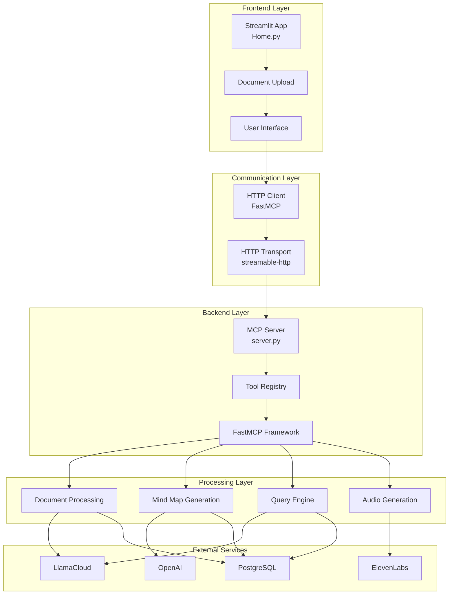

### Component Interaction Flow

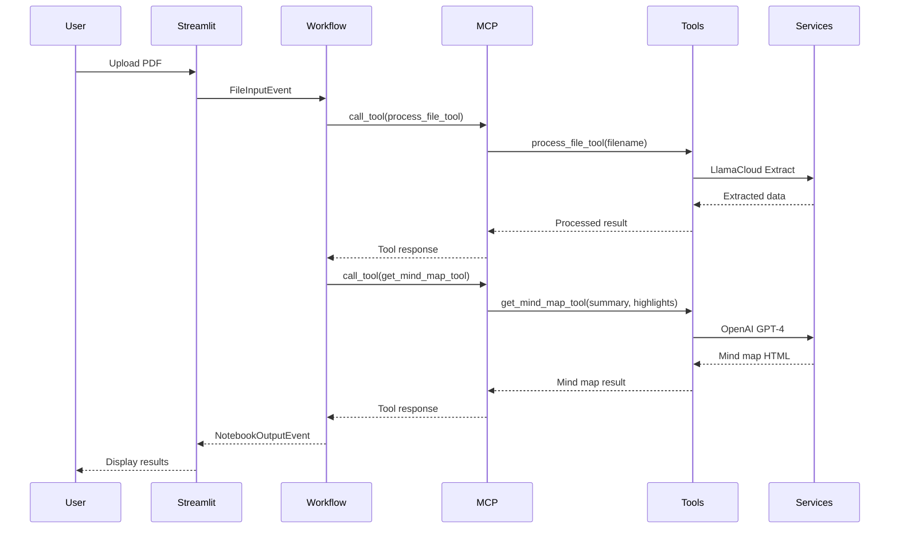

## MCP Server Deep Dive

### Server Initialization

The MCP server is built using the **FastMCP** framework and provides a standardized interface for tool execution:

```python
# Server initialization in server.py
import os
from dotenv import load_dotenv
from fastmcp import FastMCP

# Load environment variables first
load_dotenv()

# Configure OpenTelemetry at SDK level BEFORE any imports
ENABLE_OBSERVABILITY = os.getenv("ENABLE_OBSERVABILITY", "true").lower() == "true"

if not ENABLE_OBSERVABILITY:
    # Disable OpenTelemetry at SDK level
    os.environ["OTEL_TRACES_SAMPLER"] = "off"
    os.environ["OTEL_TRACES_EXPORTER"] = "none"
    os.environ["OTEL_METRICS_EXPORTER"] = "none"
    os.environ["OTEL_LOGS_EXPORTER"] = "none"

# Initialize MCP server
mcp: FastMCP = FastMCP(name="MCP For NotebookLM")
```

### Server Architecture

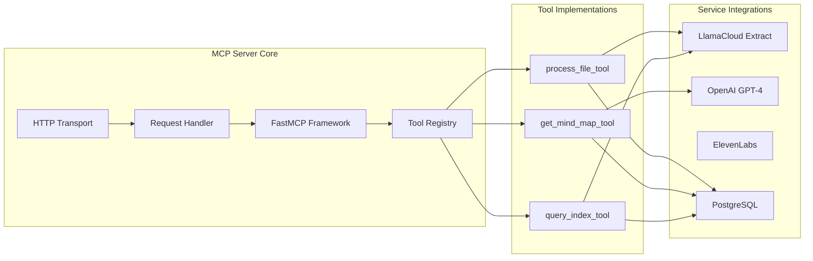

### Tool Registration Process

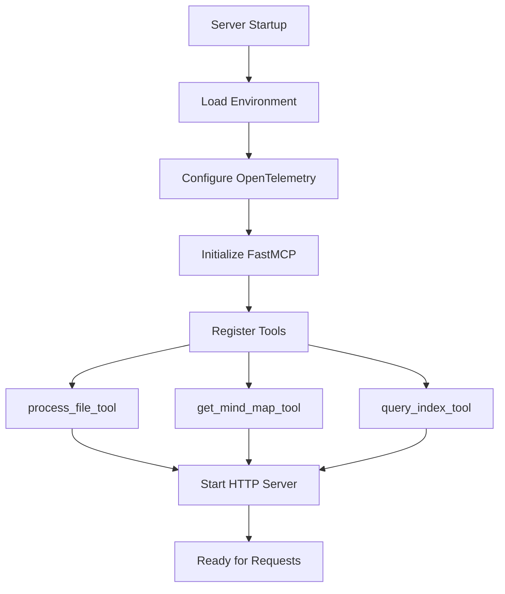

## Streamlit Integration

### Frontend-Backend Communication

The Streamlit app communicates with the MCP server through the workflow engine:

```python
# In workflow.py
from llama_index.tools.mcp import BasicMCPClient

MCP_CLIENT = BasicMCPClient(command_or_url="http://localhost:8000/mcp", timeout=120)

class NotebookLMWorkflow(Workflow):
    @step
    async def extract_file_data(self, ev: FileInputEvent, mcp_client: Annotated[BasicMCPClient, Resource(get_mcp_client)]) -> Union[MindMapCreationEvent, NotebookOutputEvent]:
        result = await mcp_client.call_tool(
            tool_name="process_file_tool", 
            arguments={"filename": ev.file}
        )
        # Process result...
```

### Integration Architecture

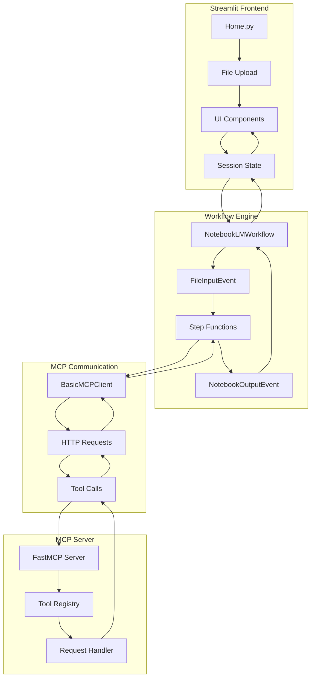

### Async Workflow Execution

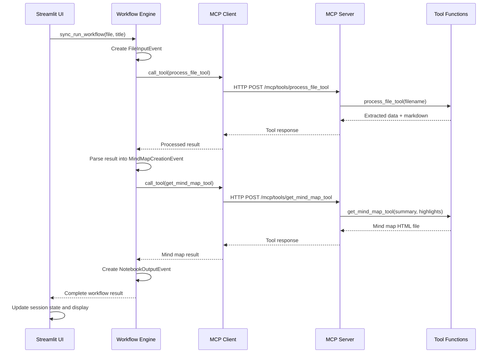

## Data Flow

### Document Processing Flow

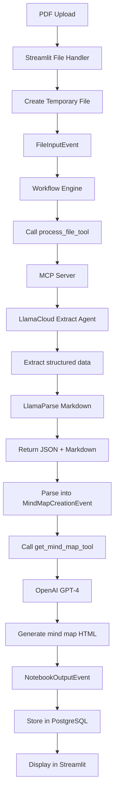

### Tool Execution Flow

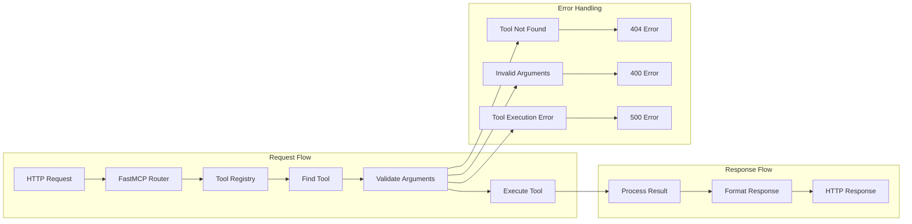

## Tool Definitions

### 1. process_file_tool

**Purpose**: Processes uploaded PDF files to extract structured data and markdown content.

**Implementation**:
```python
@mcp.tool(
    name="process_file_tool",
    description="This tool is useful to process files and produce summaries, question-answers and highlights.",
)
async def process_file_tool(
    filename: str,
) -> Union[str, Literal["Sorry, your file could not be processed."]]:
    notebook_model, text = await process_file(filename=filename)
    if notebook_model is None:
        return "Sorry, your file could not be processed."
    if text is None:
        text = ""
    return notebook_model + "\n%separator%\n" + text
```

**Data Flow**:
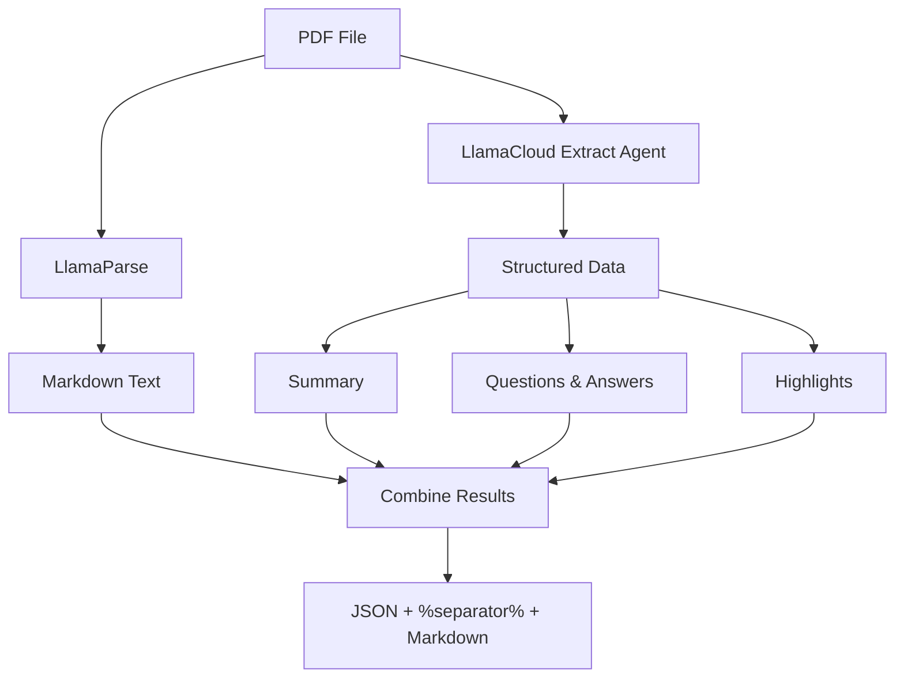

### 2. get_mind_map_tool

**Purpose**: Generates interactive mind maps from document summaries and highlights.

**Implementation**:
```python
@mcp.tool(name="get_mind_map_tool", description="This tool is useful to get a mind ")
async def get_mind_map_tool(
    summary: str, highlights: List[str]
) -> Union[str, Literal["Sorry, mind map creation failed."]]:
    mind_map_fl = await get_mind_map(summary=summary, highlights=highlights)
    if mind_map_fl is None:
        return "Sorry, mind map creation failed."
    return mind_map_fl
```

**Data Flow**:
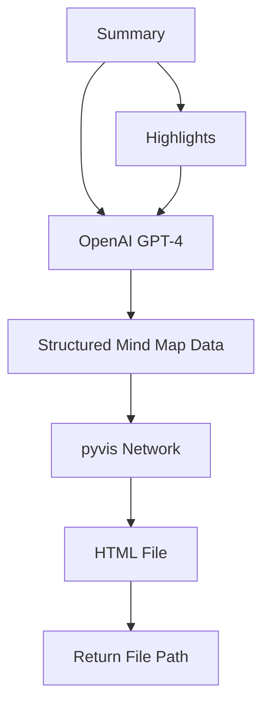

### 3. query_index_tool

**Purpose**: Queries the LlamaCloud index for document-specific questions.

**Implementation**:
```python
@mcp.tool(name="query_index_tool", description="Query a LlamaCloud index.")
async def query_index_tool(question: str) -> str:
    response = await query_index(question=question)
    if response is None:
        return "Sorry, I was unable to find an answer to your question."
    return response
```

**Data Flow**:
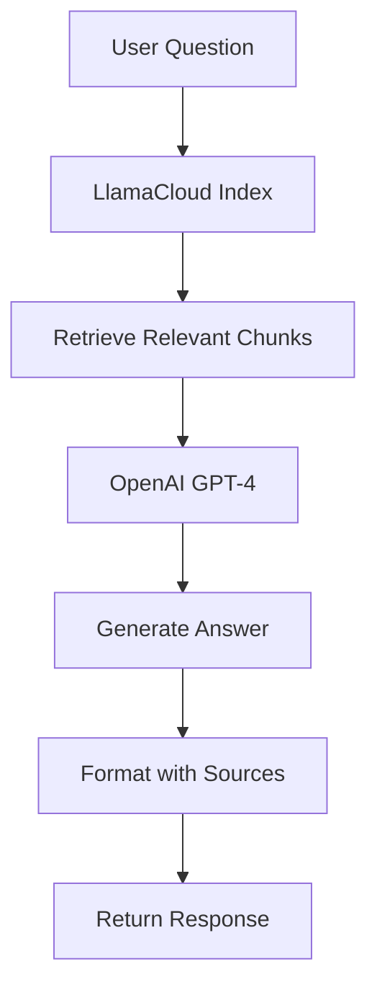

## Workflow Integration

### Workflow Steps

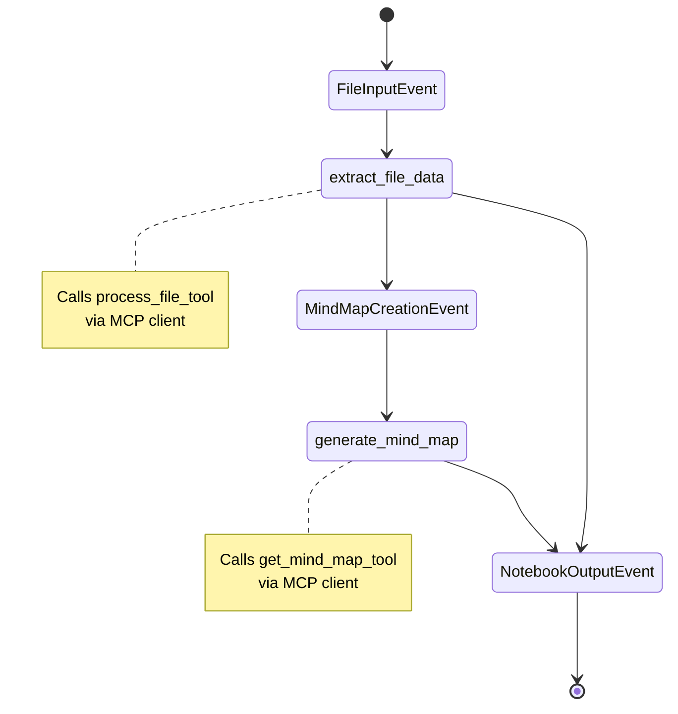

### Workflow State Management

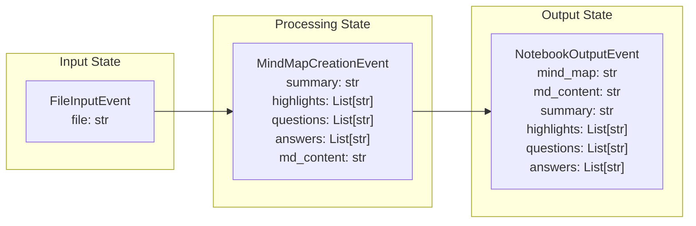

## Configuration

### Environment Variables

| Variable | Description | Default | Required |
|----------|-------------|---------|----------|
| `ENABLE_OBSERVABILITY` | Enable/disable OpenTelemetry tracing | `true` | No |
| `OTLP_ENDPOINT` | OpenTelemetry collector endpoint | `http://localhost:4318/v1/traces` | No |
| `LLAMACLOUD_API_KEY` | LlamaCloud API key for extract and index | - | Yes |
| `EXTRACT_AGENT_ID` | LlamaCloud extract agent ID | - | Yes |
| `LLAMACLOUD_PIPELINE_ID` | LlamaCloud pipeline ID | - | Yes |
| `OPENAI_API_KEY` | OpenAI API key for LLM operations | - | Yes |
| `ELEVENLABS_API_KEY` | ElevenLabs API key for audio generation | - | No |

### Server Configuration

```python
# MCP Server Configuration
mcp: FastMCP = FastMCP(name="MCP For NotebookLM")

# HTTP Transport Configuration
if __name__ == "__main__":
    mcp.run(transport="streamable-http")  # Runs on localhost:8000
```

### Client Configuration

```python
# MCP Client Configuration
MCP_CLIENT = BasicMCPClient(
    command_or_url="http://localhost:8000/mcp", 
    timeout=120
)
```

## Troubleshooting

### Common Issues

#### 1. MCP Server Not Starting

**Symptoms**: Connection refused errors, tool calls failing

**Solutions**:
```bash
# Check if server is running
curl http://localhost:8000/mcp

# Start server manually
uv run src/notebookllama/server.py

# Check logs
uv run src/notebookllama/server.py --log-level DEBUG
```

#### 2. Tool Execution Failures

**Symptoms**: Tool calls returning errors or timeouts

**Debugging**:
```python
# Add logging to tool functions
import logging
logging.basicConfig(level=logging.DEBUG)

# Check tool registration
print(mcp.list_tools())
```

#### 3. Workflow Integration Issues

**Symptoms**: Workflow steps failing, events not processing

**Solutions**:
```python
# Verify MCP client connection
try:
    result = await MCP_CLIENT.call_tool("process_file_tool", {"filename": "test.pdf"})
    print("MCP connection successful")
except Exception as e:
    print(f"MCP connection failed: {e}")
```

### Debugging Tools

#### 1. MCP Server Health Check

```bash
# Check server status
curl -X POST http://localhost:8000/mcp/tools/list \
  -H "Content-Type: application/json"
```

#### 2. Tool Testing

```bash
# Test process_file_tool
curl -X POST http://localhost:8000/mcp/tools/process_file_tool \
  -H "Content-Type: application/json" \
  -d '{"filename": "/path/to/test.pdf"}'
```

#### 3. Workflow Debugging

```python
# Add debug logging to workflow
import logging
logging.basicConfig(level=logging.DEBUG)

# Test individual steps
async def test_workflow():
    ev = FileInputEvent(file="test.pdf")
    result = await WF.run(start_event=ev)
    print(f"Workflow result: {result}")
```

## Development Guide

### Adding New Tools

1. **Define Tool Function**:
```python
@mcp.tool(
    name="new_tool",
    description="Description of what the tool does."
)
async def new_tool(param1: str, param2: int) -> str:
    # Tool implementation
    result = await some_async_operation(param1, param2)
    return result
```

2. **Register Tool**:
```python
# Tools are automatically registered when decorated with @mcp.tool
```

3. **Test Tool**:
```python
# Test via MCP client
result = await MCP_CLIENT.call_tool("new_tool", {"param1": "value", "param2": 42})
```

### Extending Workflow

1. **Add New Event Type**:
```python
class NewEvent(Event):
    data: str
```

2. **Add New Step**:
```python
@step
async def new_step(
    self,
    ev: PreviousEvent,
    mcp_client: Annotated[BasicMCPClient, Resource(get_mcp_client)]
) -> NewEvent:
    result = await mcp_client.call_tool("new_tool", {"data": ev.data})
    return NewEvent(data=result)
```

3. **Update Workflow**:
```python
class ExtendedWorkflow(Workflow):
    # Add new steps to workflow
    pass
```

### Performance Optimization

#### 1. Connection Pooling

```python
# Use connection pooling for database operations
from sqlalchemy.pool import QueuePool

engine = create_engine(
    database_url,
    poolclass=QueuePool,
    pool_size=10,
    max_overflow=20
)
```

#### 2. Caching

```python
# Add caching for expensive operations
import functools
from typing import Dict, Any

@functools.lru_cache(maxsize=128)
def cached_operation(data: str) -> Dict[str, Any]:
    # Expensive operation
    pass
```

#### 3. Async Optimization

```python
# Use asyncio.gather for parallel operations
async def parallel_operations():
    tasks = [
        operation1(),
        operation2(),
        operation3()
    ]
    results = await asyncio.gather(*tasks)
    return results
```

### Monitoring and Observability

#### 1. OpenTelemetry Integration

```python
# Enable tracing for tool execution
from opentelemetry import trace

tracer = trace.get_tracer(__name__)

@mcp.tool(name="monitored_tool")
async def monitored_tool():
    with tracer.start_as_current_span("tool_execution"):
        # Tool implementation
        pass
```

#### 2. Metrics Collection

```python
# Add custom metrics
from opentelemetry import metrics

meter = metrics.get_meter(__name__)
tool_counter = meter.create_counter("tool_executions")

@mcp.tool(name="metric_tool")
async def metric_tool():
    tool_counter.add(1, {"tool_name": "metric_tool"})
    # Tool implementation
```

This comprehensive documentation provides a complete understanding of the MCP server architecture, its integration with the Streamlit app, and practical guidance for development and troubleshooting. 